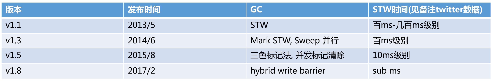
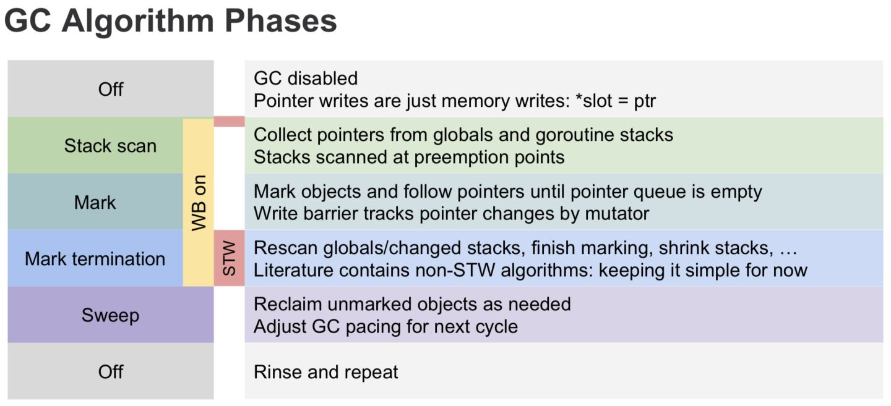
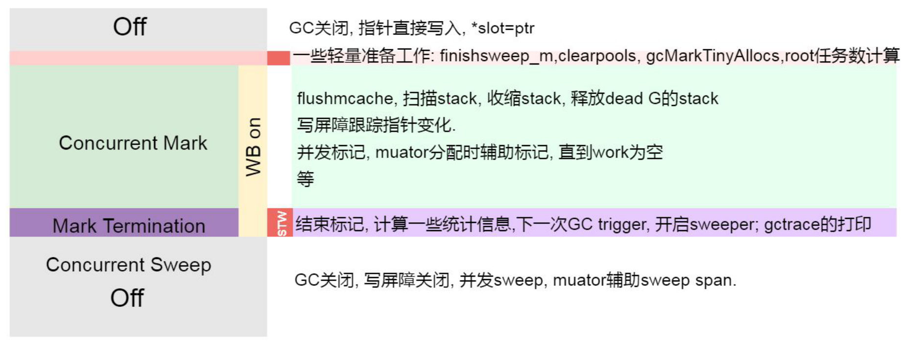
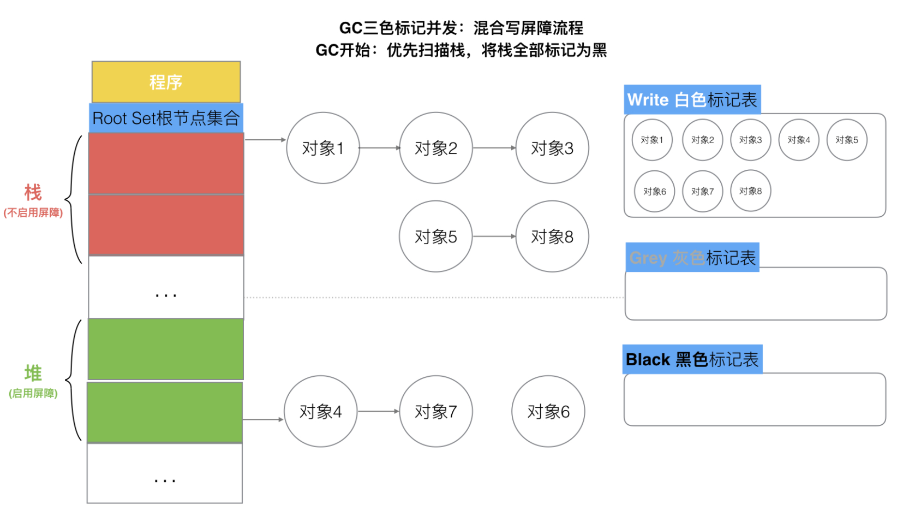
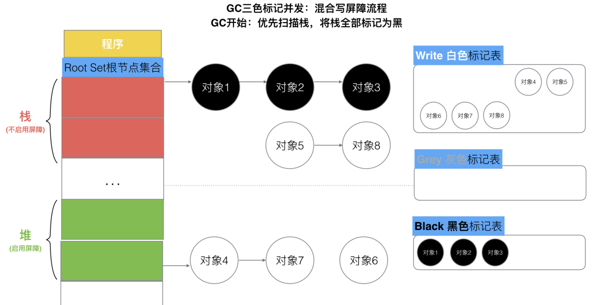

# Go 垃圾回收

### 简介

垃圾回收(Garbage Collection，简称GC)是编程语言中提供的自动的内存管理机制，自动释放不需要的对象，让出存储器资源，
无需程序员手动执行。

Golang 中的垃圾回收主要应用三色标记法，GC 过程和 goroutine 并发运行，但需要一定时间的 STW(stop the world)，
STW 的过程中，CPU 不执行用户代码。Golang 进行了多次的迭代优化来解决这个问题。



> v1.1 版本使用标记-清除的方式，整个过程需要 STW 。

> v1.3 版本分离了标记和清扫的操作，标记时 STW，清扫并发执行 。

> v1.5 版本标记过程中使用三色标记法，使用了 Dijkstra 插入写屏障。在开启 GC 时，需要短暂的 STW 来做准备工作(开启屏障等)，之后标记并发执行，
标记完成后需要 STW 一定时间来做 GC 收尾工作(关闭屏障等)，以及栈的重新扫描(比较耗时)，最后并发清除。



> v1.8 版本引入了混合写屏障机制(Dijkstra 插入写屏障、Yuasa的删除写屏障)，避免了对栈 re-scan 的过程，极大的减少了 STW 的时间。**

> v1.12 版本对 Mark Termination 进行了优化



### 标记-清扫算法

标记清除（Mark-Sweep）算法是最常见的垃圾收集算法，分为标记、清除两个步骤。

> 标记阶段 — 从根对象出发查找并标记堆中所有存活的对象；

> 清除阶段 — 遍历堆中的全部对象，回收未被标记的垃圾对象并将回收的内存加入空闲链表；

> 根：是一个有限的指针集合，程序可不经过其他对象直接访问这些指针，堆中的对象被加载时，需要先加载根中的指针。
> 在 Go 中，一般为 goroutine 自己的栈空间和全局栈空间。

标记结束后，依次遍历堆中的对象并清除其中的垃圾。整个 GC 过程都需要 STW。

> 从根对象出发依次遍历对象的子对象并将从根节点可达的对象都标记成存活状态，
> 即 A、C 和 D 三个对象，剩余的 B、E 和 F 三个对象因为从根节点不可达，所以会被当做垃圾。


> 遍历清除。


### 三色标记算法

三色标记算法出现，为了减少 STW 的时间，算法将程序中的对象分成白色、黑色和灰色三类。

> 白色对象 — 潜在的垃圾，其内存可能会被垃圾收集器回收；
>
> 黑色对象 — 活跃的对象，包括不存在任何引用外部指针的对象以及从根对象可达的对象；
>
> 灰色对象 — 活跃的对象，因为存在指向白色对象的外部指针，垃圾收集器会扫描这些对象的子对象；

**工作原理**

> 从灰色对象的集合中选择一个灰色对象并将其标记成黑色;
>
> 将黑色对象指向的所有对象都标记成灰色，保证该对象和被该对象引用的对象都不会被回收；
>
> 重复上述两个步骤直到对象图中不存在灰色对象；


当标记结束后，只存在黑色对象和白色对象，垃圾收集器把白色对象进行回收。

在标记执行的过程中不能修改对象的指针，仍需要 STW。不然会造成本来不应该被回收的对象却被回收了。

> 用户程序建立了从 A 对象到 D 对象的引用，但是因为程序中已经不存在灰色对象了，所以 D 对象会被垃圾收集器错误地回收。


对象异常回收，在内存管理中是非常严重的错误，我们将这种错误称为悬挂指针，即指针没有指向特定类型的合法对象，影响了内存的安全性5，想要并发或者增量地标记对象还是需要使用屏障技术。

### 屏障技术

**三色不变式**

想要在并发或者增量的标记算法中保证正确性，我们需要达成以下两种三色不变性（Tri-color invariant）中的任意一种。

> 强三色不变性 — 黑色对象不会指向白色对象，只会指向灰色对象或者黑色对象；

> 弱三色不变性 — 黑色对象指向的白色对象必须包含一条从灰色对象经由多个白色对象的可达路径。


**Dijkstra 插入写屏障**

插入写屏障满足强三色不变性，强制拦截将白色指针插入黑色对象的操作，标记其对应对象为灰色状态。

```cgo
writePointer(slot, ptr):
    shade(ptr)
    *slot = ptr
```

写屏障通过 shade 函数尝试改变指针的颜色。如果 ptr 指针是白色的，那么该函数会将该对象设置成灰色，其他情况则保持不变。


场景：

> A.添加下游对象(nil, B)  // A之前没有下游， 新添加一个下游对象B， B被标记为灰色。
>
> A.添加下游对象(C, B)     //A 将下游对象C 更换为B，  B被标记为灰色。

因为栈空间调用频繁，如果对栈开启写屏障，会增大程序的开销。所以写屏障只在堆空间上使用，栈空间并不启用。
所以在标记结束后，需要 STW 对栈空间从小进行扫描。如果此时有大量 goroutine 会导致 GC 时间增加。

v1.5 的垃圾回收机制，就是利用三色标记+Dijkstra 插入写屏障来实现的，回收时间10ms级别。

**Yuasa 删除写屏障**

删除写屏障满足了弱三色不变式。被删除的对象，如果自身为灰色或者白色，那么被标记为灰色。保护灰色对象到白色对象的路径不会断。

```cgo
writePointer(slot, ptr):
    if (isGery(slot) || isWhite(slot))
        shade(*slot)
    *slot = ptr
```

这种方式的回收精度低，一个对象即使被删除了最后一个指向它的指针也依旧可以活过这一轮，在下一轮GC中被清理掉。


场景：

> A.添加下游对象(B, nil)   //A对象，删除B对象的引用。  B被A删除，被标记为灰(如果B之前为白)
> 
> A.添加下游对象(B, C)		 //A对象，更换下游B变成C。   B被A删除，被标记为灰(如果B之前为白)

### 混合屏障

插入写屏障和删除写屏障的短板：

> Dijkstra的插入写屏障在标记开始时无需STW，可直接开始，并发进行，但结束时需要STW来重新扫描栈，标记栈上引用的白色对象的存活。
>
> Yuasa的删除写屏障则需要在GC开始时STW扫描堆栈来记录初始快照，这个过程会保护开始时刻的所有存活对象，但结束时无需STW。

混合写屏障：

```cgo
writePointer(slot, ptr):
    shade(*slot)
    if current stack is grey:
        shade(ptr)
    *slot = ptr
```

具体操作：

> GC开始将栈上的对象全部扫描并标记为黑色(之后不再进行第二次重复扫描，无需STW);
>
> GC期间，任何在栈上创建的新对象，均为黑色。
>
> 被删除的对象标记为灰色。
>
> 被添加的对象标记为灰色。

屏障技术只在堆上开启，不在栈上开启。

GC开始默认白色。



扫描栈区，将可达对象全部标记为黑。



Golang 中的混合写屏障满足弱三色不变式，结合了删除写屏障和插入写屏障的优点，只需要在开始时并发扫描各个 goroutine 的栈，使其变黑并一直保持，
这个过程不需要 STW，而标记结束后，因为栈在扫描后始终是黑色的，也无需再进行 re-scan 操作了，减少了 STW 的时间。

V1.8-三色标记法，混合写屏障机制， 栈空间不启动，堆空间启动。整个过程几乎不需要 STW，sub ms单位。


**参考**

[Go修养之路](https://www.kancloud.cn/aceld/golang/1958308#Go_V18hybrid_write_barrier_310)

[Go语言设计与实现](https://draveness.me/golang/docs/part3-runtime/ch07-memory/golang-garbage-collector/#72-%E5%9E%83%E5%9C%BE%E6%94%B6%E9%9B%86%E5%99%A8)


