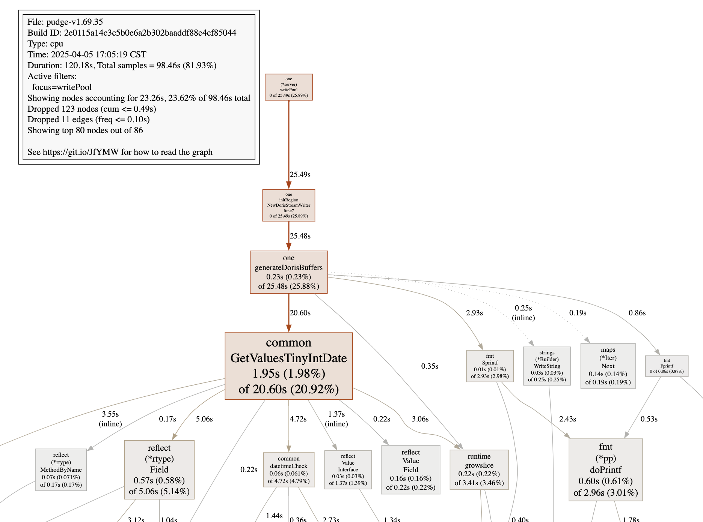
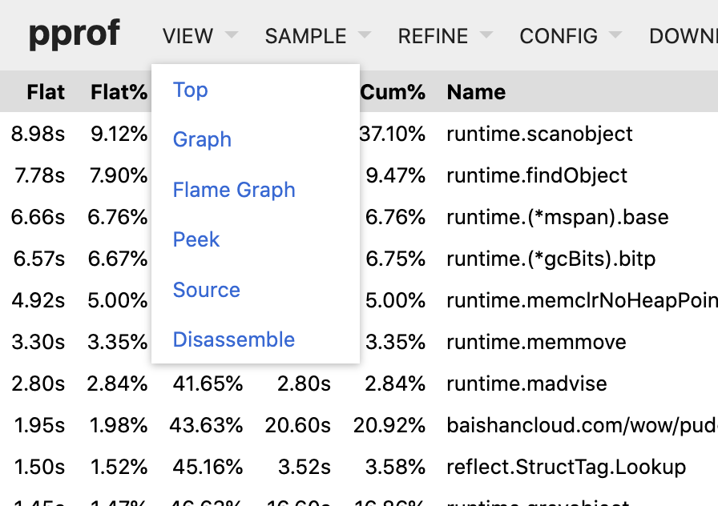
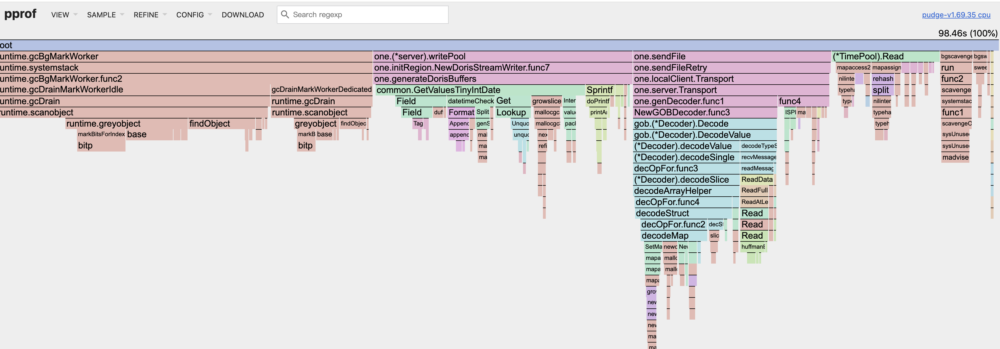
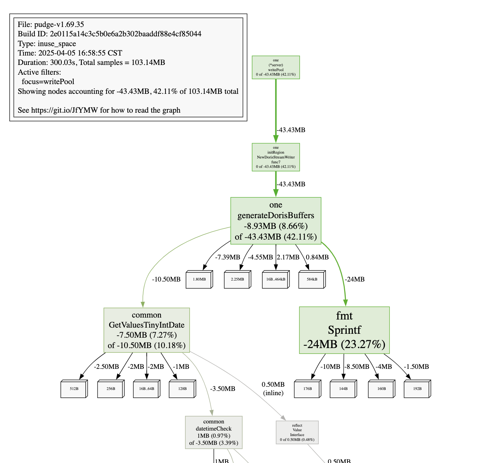

# 目录

* [PProf](#PProf)
    * [采集方式](#采集方式)
    * [采样类型](#采样类型)
    * [CPU](#cpu-profile)
    * [Memory](#memory-profile)
    * [Goroutine](#goroutine-profile)
    * [Mutex](#mutex-profile)
* [Trace](#trace)
* [References](#references)


## PProf

PProf 是 Go 语言的性能分析工具，提供了多种性能分析功能，包括 CPU 分析、内存分析、阻塞分析和 Goroutine 分析等。它可以帮助开发者识别性能瓶颈和内存泄漏等问题。

### 采集方式

#### 1、`runtime/pprof` 指定区块的运行数据进行分析。

``` go
// To add equivalent profiling support to a standalone program, add
// code like the following to your main function:

var cpuprofile = flag.String("cpuprofile", "", "write cpu profile to `file`")
var memprofile = flag.String("memprofile", "", "write memory profile to `file`")

func main() {
    flag.Parse()
    if *cpuprofile != "" {
        f, err := os.Create(*cpuprofile)
        if err != nil {
            log.Fatal("could not create CPU profile: ", err)
        }
        defer f.Close() // error handling omitted for example
        if err := pprof.StartCPUProfile(f); err != nil {
            log.Fatal("could not start CPU profile: ", err)
        }
        defer pprof.StopCPUProfile()
    }

    // ... rest of the program ...

    if *memprofile != "" {
        f, err := os.Create(*memprofile)
        if err != nil {
            log.Fatal("could not create memory profile: ", err)
        }
        defer f.Close() // error handling omitted for example
        runtime.GC() // get up-to-date statistics
        // Lookup("allocs") creates a profile similar to go test -memprofile.
        // Alternatively, use Lookup("heap") for a profile
        // that has inuse_space as the default index.
        if err := pprof.Lookup("allocs").WriteTo(f, 0); err != nil {
            log.Fatal("could not write memory profile: ", err)
        }
    }
}
```

执行代码生成 CPU profile 文件：

```bash
$ go run main.go -cpuprofile=profile.prof
```

#### 2、`net/http/pprof` 基于 HTTP Server 运行，并且可以采集运行时数据进行分析。

``` go
import _ "net/http/pprof"

go func() {
	http.ListenAndServe("localhost:6060", nil)
}()
......
```

默认注册的 `Handler` 方法：

```go
// net/http/pprof

func init() {
	prefix := ""
	if godebug.New("httpmuxgo121").Value() != "1" {
		prefix = "GET "
	}
	http.HandleFunc(prefix+"/debug/pprof/", Index)
	http.HandleFunc(prefix+"/debug/pprof/cmdline", Cmdline)
	http.HandleFunc(prefix+"/debug/pprof/profile", Profile)
	http.HandleFunc(prefix+"/debug/pprof/symbol", Symbol)
	http.HandleFunc(prefix+"/debug/pprof/trace", Trace)
}
```

使用 `GET` 方法访问 `http://localhost:6060/debug/pprof/`，可以查看当前运行的 `goroutine`、`heap`、`goroutine`、`block` 等信息。

参数：

* debug=N (all profiles): response format: N = 0: binary (default), N > 0: plaintext
* gc=N (heap profile): N > 0: run a garbage collection cycle before profiling
* seconds=N (allocs, block, goroutine, heap, mutex, threadcreate profiles): return a delta profile
* seconds=N (cpu (profile), trace profiles): profile for the given duration

示例1：获取 CPU profile 的数据，默认采样时间为 30 秒。

```bash
$ go tool pprof http://localhost:6060/debug/pprof/profile?seconds=30
```

示例2：通常会下载 profile 文件到本地，然后使用 `go tool pprof` 命令分析。

```bash
$ curl -o heap.prof http://localhost:6060/debug/pprof/heap?seconds=5&gc=1
$ go tool pprof heap.prof
```

示例3：设置 `debug` 参数值可以查看当前的 `goroutine` 可打印 `plaintext`堆栈信息。

```bash
$ curl http://localhost:6060/debug/pprof/goroutine\?debug\=2
$ curl http://localhost:6060/debug/pprof/goroutine\?debug\=1
```

示例4:有时会有许多样本数较少的节点遮住了大样本数，忽略占样本数至少 10% 的节点。

```bash
$ go tool pprof --nodefraction=0.1 profile.prof
```

示例5：浏览器访问 `http://localhost:6060/debug/pprof/`，可以查看当前运行的 `goroutine`、`heap`、`goroutine`、`block` 等信息。

```
/debug/pprof/
Set debug=1 as a query parameter to export in legacy text format

Types of profiles available:
Count	Profile
2	allocs
0	block
0	cmdline
4	goroutine
2	heap
0	mutex
0	profile
0	symbol
5	threadcreate
0	trace
full goroutine stack dump
```

#### 3、`go test` 通过运行测试用例，并指定所需标识来进行采集

The first step to profiling a Go program is to enable profiling.
Support for profiling benchmarks built with the standard testing
package is built into go test. For example, the following command
runs benchmarks in the current directory and writes the CPU and
memory profiles to cpu.prof and mem.prof:

```bash
$ go test -cpuprofile cpu.prof -memprofile mem.prof -bench .
```

示例：`benchmark` 对比每次申请新 `map` 和使用 `sync.Pool` 申请的 `map` 的性能差异。

```go
package main_test

import (
	"sync"
	"testing"
)

func BenchmarkNormalMap(b *testing.B) {
	for i := 0; i < b.N; i++ {
		m := make(map[int]int)
		for j := 0; j < 100000; j++ {
			m[j] = j
		}

		for j := 0; j < 100000; j++ {
			_ = m[j]
		}
	}
}

func BenchmarkPreallocMap(b *testing.B) {
	for i := 0; i < b.N; i++ {
		m := make(map[int]int, 100000)
		for j := 0; j < 100000; j++ {
			m[j] = j
		}

		for j := 0; j < 100000; j++ {
			_ = m[j]
		}
	}
}

var pool = &sync.Pool{
	New: func() interface{} {
		return make(map[int]int, 100000)
	},
}

func BenchmarkSyncPoolMap(b *testing.B) {
	for i := 0; i < b.N; i++ {
		m := pool.Get().(map[int]int)
		for j := 0; j < 100000; j++ {
			m[j] = j
		}
		clear(m)
		pool.Put(m)
	}
}
```
运行测试用例，在当前目录下生成 `cpu.prof` 和 `mem.prof`：

```bash
$ go test -cpuprofile cpu.prof -memprofile mem.prof -bench .
```

### 采样类型

在 `net/http/pprof` 源码中定义了 `profileDescriptions` 变量，包含了所有支持的采样类型。

```go
"allocs":       "A sampling of all past memory allocations",
"block":        "Stack traces that led to blocking on synchronization primitives",
"cmdline":      "The command line invocation of the current program",
"goroutine":    "Stack traces of all current goroutines. Use debug=2 as a query parameter to export in the same format as an unrecovered panic.",
"heap":         "A sampling of memory allocations of live objects. You can specify the gc GET parameter to run GC before taking the heap sample.",
"mutex":        "Stack traces of holders of contended mutexes",
"profile":      "CPU profile. You can specify the duration in the seconds GET parameter. After you get the profile file, use the go tool pprof command to investigate the profile.",
"symbol":       "Maps given program counters to function names. Counters can be specified in a GET raw query or POST body, multiple counters are separated by '+'.",
"threadcreate": "Stack traces that led to the creation of new OS threads",
"trace":        "A trace of execution of the current program. You can specify the duration in the seconds GET parameter. After you get the trace file, use the go tool trace command to investigate the trace.",
```

常用的采样类型：

* `profile`：CPU 分析，按照一定的频率采集所监听的应用程序 CPU（含寄存器）的使用情况，可确定应用程序在主动消耗 CPU 周期时花费时间的位置。
* `heap`：内存分析，在应用程序进行堆分配时记录堆栈跟踪，用于监视当前和历史内存使用情况，以及检查内存泄漏。
* `block`：阻塞分析，记录 goroutine 阻塞等待同步（包括定时器通道）的位置，默认不开启，需要调用 `runtime.SetBlockProfileRate` 进行设置。
* `mutex`：互斥锁分析，报告互斥锁的竞争情况，默认不开启，需要调用 `runtime.SetMutexProfileFraction` 进行设置。
* `goroutine`： goroutine 分析，可以对当前应用程序正在运行的 goroutine 进行堆栈跟踪和分析。这项功能在实际排查中会经常用到，因为很多问题出现时的表象就是 goroutine 暴增，而这时候我们要做的事情之一就是查看应用程序中的 goroutine 正在做什么事情，因为什么阻塞了，然后再进行下一步。


### CPU Profile

启用 `profile` 分析后，`Go` 程序每秒会停止大约 100 次，并记录由当前执行的 `goroutine` 堆栈上的程序计数器组成的样本。这些样本会被写入到 `cpu.prof` 文件中，然后使用 `go tool pprof` 命令进行分析。

```bash
$ curl -o profile.prof http://localhost:6060/debug/pprof/profile?seconds=60
$ go tool pprof profile.prof
```

**常用的两种分析方式：交互命令行、可视化页面**

#### 交互命令行

`go tool pprof` 程序是 [Google 的 pprof C++ 分析器](https://github.com/gperftools/gperftools) 。最重要的命令是 topN ，它显示分析中的前 N 样本，默认 N=10：

```
(pprof) top 10
Showing nodes accounting for 45.91s, 46.63% of 98.46s total
Dropped 615 nodes (cum <= 0.49s)
Showing top 10 nodes out of 165
      flat  flat%   sum%        cum   cum%
     8.98s  9.12%  9.12%     36.53s 37.10%  runtime.scanobject
     7.78s  7.90% 17.02%      9.32s  9.47%  runtime.findObject
     6.66s  6.76% 23.79%      6.66s  6.76%  runtime.(*mspan).base (inline)
     6.57s  6.67% 30.46%      6.65s  6.75%  runtime.(*gcBits).bitp (inline)
     4.92s  5.00% 35.46%      4.92s  5.00%  runtime.memclrNoHeapPointers
     3.30s  3.35% 38.81%      3.30s  3.35%  runtime.memmove
     2.80s  2.84% 41.65%      2.80s  2.84%  runtime.madvise
     1.95s  1.98% 43.63%     20.60s 20.92%  baishancloud.com/wow/pudge/common.GetValuesTinyIntDate
     1.50s  1.52% 45.16%      3.52s  3.58%  reflect.StructTag.Lookup
     1.45s  1.47% 46.63%     16.60s 16.86%  runtime.greyobject
```

样本会丢弃掉一些不重要的节点，如上面显示的 `Dropped 615 nodes (cum <= 0.49s)`。

`top` 显示字段的含义：

* flat：表示当前函数的运行时间；
* flat%：flat 占总运行时间的百分比；
* sum%：累计值，前面所有函数累计百分比；
* cum：表示当前函数的运行时间加上它调用的其他函数的运行时间；
* cum%：cum 占总运行时间的百分比。

使用 `-cum` 标志可以按照累计值进行排序显示。

```
(pprof) top -cum 10
Showing nodes accounting for 11.35s, 11.53% of 98.46s total
Dropped 615 nodes (cum <= 0.49s)
Showing top 10 nodes out of 165
      flat  flat%   sum%        cum   cum%
     0.04s 0.041% 0.041%     42.13s 42.79%  runtime.systemstack
         0     0% 0.041%     37.04s 37.62%  runtime.gcBgMarkWorker
         0     0% 0.041%     37.04s 37.62%  runtime.gcBgMarkWorker.func2
     0.15s  0.15%  0.19%     37.03s 37.61%  runtime.gcDrain
     8.98s  9.12%  9.31%     36.53s 37.10%  runtime.scanobject
         0     0%  9.31%     26.98s 27.40%  runtime.gcDrainMarkWorkerIdle (inline)
         0     0%  9.31%     25.49s 25.89%  baishancloud.com/wow/pudge/one.(*server).writePool
         0     0%  9.31%     25.49s 25.89%  baishancloud.com/wow/pudge/one.initRegion.NewDorisStreamWriter.func7
     0.23s  0.23%  9.55%     25.48s 25.88%  baishancloud.com/wow/pudge/one.generateDorisBuffers
     1.95s  1.98% 11.53%     20.60s 20.92%  baishancloud.com/wow/pudge/common.GetValuesTinyIntDate
```

`runtime.gcDrain` 和 `runtime.scanobject` 表示系统 `GC` 的时间占比高，`runtime.gcBgMarkWorker` 表示 `GC` 的后台工作线程。程序的瓶颈在于频繁的 `GC` 对系统的压力。

使用 `web` 命令显示函数调用关系数据，会自动在浏览器打开可视化图。`web func()` 可以指定函数名，显示该函数的调用关系图，减少噪音聚焦到关键函数上。

```
(pprof) web writePool
```

<div align=center></div>

图中可以发现程序开销主要消耗在 `common.GetValuesTinyIntDate` 函数上，使用 `list` 对特定函数进行放大。

``` 
(pprof) list NewDorisStreamWriter.func7
Total: 98.46s
ROUTINE ======================== baishancloud.com/wow/pudge/one.initRegion.NewDorisStreamWriter.func7 in /Users/连长/Code/Go/src/pudge/one/writers.go
         .          .    640:
         .          .    641:		if maxSize == 0 {
         .          .    642:			maxSize = 10 * 1024 * 1024 * 1024 // 10GB
         .          .    643:		}
         .          .    644:
         .     25.48s    645:		bufferList, keysList, err := generateDorisBuffers(pool, columns, maxSize)
         .          .    646:		if err != nil {
         .          .    647:			return 0, lf, err
         .          .    648:		}
         .          .    649:

ROUTINE ======================== baishancloud.com/wow/pudge/one.generateDorisBuffers in /Users/连长/Code/Go/src/pudge/one/writers.go
     230ms     25.48s (flat, cum) 25.88% of Total
         .          .    573:func generateDorisBuffers(pool *common.TimePool, columns []string, maxSize int) ([]*bytes.Buffer, [][]interface{}, error) {
         .          .    574:	bufList := []*bytes.Buffer{new(bytes.Buffer)}
         .          .    575:	keysList := [][]interface{}{{}}
         .          .    576:	template := strings.TrimSpace(strings.Repeat("%v\t", len(columns))) + "\n"
         .          .    577:
         .          .    578:	bufSize := 0
         .          .    579:	bufIndex := 0
         .          .    580:	rows := []string{}
      90ms      280ms    581:	for k, v := range pool.Map {
      50ms     18.76s    582:		row := fmt.Sprintf(template, append(common.GetValuesTinyIntDate(k),
         .      4.88s    583:					common.GetValuesTinyIntDate(v)...)...)
         .          .    584:

(pprof) list GetValuesTinyIntDate
Total: 98.46s
ROUTINE ======================== baishancloud.com/wow/pudge/common.GetValuesTinyIntDate in /Users/连长/Code/Go/src/pudge/common/sql.go
     1.95s     20.60s (flat, cum) 20.92% of Total
      10ms       10ms    121:func GetValuesTinyIntDate(v interface{}) []interface{} {
         .          .    122:	var values []interface{}
         .       10ms    123:	rv := reflect.ValueOf(v)
      10ms      190ms    124:	if f, ok := rv.Type().MethodByName("Values"); ok {
         .          .    125:		return f.Func.Call([]reflect.Value{rv})[0].Interface().([]interface{})
         .          .    126:	}
         .       10ms    127:	if rv.Type().Kind() == reflect.Ptr {
         .       40ms    128:		rv = reflect.Indirect(reflect.ValueOf(v))
         .          .    129:	}
      50ms      190ms    130:	for i := 0; i < rv.Type().NumField(); i++ {
     100ms      3.50s    131:		if k := rv.Type().Field(i).Type.Kind(); k == reflect.Ptr || k == reflect.Struct {
         .          .    132:			values = append(values, getValues(rv.Field(i).Interface())...)
     110ms      5.60s    133:		} else if n := rv.Type().Field(i).Tag.Get("column"); n != "" {
     100ms      1.69s    134:			switch val := rv.Field(i).Interface().(type) {
     470ms      470ms    135:			case bool:
         .          .    136:				if val == true {
      20ms      420ms    137:					values = append(values, 1)
         .          .    138:				} else if val == false {
      40ms      430ms    139:					values = append(values, 0)
         .          .    140:				}
      90ms       90ms    141:			case int64:
     700ms      6.68s    142:				values = append(values, datetimeCheck(n, val))
         .          .    143:			default:
     230ms      1.25s    144:				values = append(values, val)
         .          .    145:			}
         .          .    146:		}
         .          .    147:	}
      20ms       20ms    148:	return values
         .          .    149:}
         .          .    150:
         .          .    151:func getValues(v interface{}) []interface{} {
         .          .    152:	var values []interface{}
         .          .    153:	rv := reflect.ValueOf(v)
```

第一列表示当前代码行 cpu 采样耗时，第二列表示代码行调用其他函数 cpu 采样耗时。从上面可以清晰的定位到开销大的函数代码行。

命令 `tree -cum 10` 可以显示函数调用关系图，根据 `cum` 值进行排序。

```
(pprof) tree -cum 10
Showing nodes accounting for 11.35s, 11.53% of 98.46s total
Dropped 615 nodes (cum <= 0.49s)
Showing top 10 nodes out of 165
----------------------------------------------------------+-------------
      flat  flat%   sum%        cum   cum%   calls calls% + context
----------------------------------------------------------+-------------
                                            37.04s 87.92% |   runtime.gcBgMarkWorker
                                             0.45s  1.07% |   baishancloud.com/wow/pudge/common.GetValuesTinyIntDate
                                             0.12s  0.28% |   baishancloud.com/wow/pudge/one.generateDorisBuffers
     0.04s 0.041% 0.041%     42.13s 42.79%                | runtime.systemstack
                                            37.04s 87.92% |   runtime.gcBgMarkWorker.func2
----------------------------------------------------------+-------------
         0     0% 0.041%     37.04s 37.62%                | runtime.gcBgMarkWorker
                                            37.04s   100% |   runtime.systemstack
----------------------------------------------------------+-------------
                                            37.04s   100% |   runtime.systemstack
         0     0% 0.041%     37.04s 37.62%                | runtime.gcBgMarkWorker.func2
                                            26.98s 72.84% |   runtime.gcDrainMarkWorkerIdle (inline)
                                            10.05s 27.13% |   runtime.gcDrain
----------------------------------------------------------+-------------
                                            26.98s 72.86% |   runtime.gcDrainMarkWorkerIdle
                                            10.05s 27.14% |   runtime.gcBgMarkWorker.func2
     0.15s  0.15%  0.19%     37.03s 37.61%                | runtime.gcDrain
                                            36.52s 98.62% |   runtime.scanobject
----------------------------------------------------------+-------------
                                            36.52s   100% |   runtime.gcDrain
     8.98s  9.12%  9.31%     36.53s 37.10%                | runtime.scanobject
----------------------------------------------------------+-------------
                                            26.98s   100% |   runtime.gcBgMarkWorker.func2 (inline)
         0     0%  9.31%     26.98s 27.40%                | runtime.gcDrainMarkWorkerIdle
                                            26.98s   100% |   runtime.gcDrain
----------------------------------------------------------+-------------
         0     0%  9.31%     25.49s 25.89%                | baishancloud.com/wow/pudge/one.(*server).writePool
                                            25.49s   100% |   baishancloud.com/wow/pudge/one.initRegion.NewDorisStreamWriter.func7
----------------------------------------------------------+-------------
                                            25.49s   100% |   baishancloud.com/wow/pudge/one.(*server).writePool
         0     0%  9.31%     25.49s 25.89%                | baishancloud.com/wow/pudge/one.initRegion.NewDorisStreamWriter.func7
                                            25.48s   100% |   baishancloud.com/wow/pudge/one.generateDorisBuffers
----------------------------------------------------------+-------------
                                            25.48s   100% |   baishancloud.com/wow/pudge/one.initRegion.NewDorisStreamWriter.func7
     0.23s  0.23%  9.55%     25.48s 25.88%                | baishancloud.com/wow/pudge/one.generateDorisBuffers
                                            20.60s 80.85% |   baishancloud.com/wow/pudge/common.GetValuesTinyIntDate
                                             0.12s  0.47% |   runtime.systemstack
----------------------------------------------------------+-------------
                                            20.60s   100% |   baishancloud.com/wow/pudge/one.generateDorisBuffers
     1.95s  1.98% 11.53%     20.60s 20.92%                | baishancloud.com/wow/pudge/common.GetValuesTinyIntDate
                                             0.45s  2.18% |   runtime.systemstack
----------------------------------------------------------+-------------
```

#### 可视化界面

除了上面在交互命令行中，执行 `web` 命令打开可视化页面外，还可以启动 `HTTP` 服务指定端口号运行一个 `PProf` 的分析用的站点。

```bash
$ go tool pprof -http=:6001 profile 
```

在 View 菜单栏中，`PProf` 还支持多种分析方式的切换：

<div align=center></div>

`Flame Graph` 显示火焰图，可以非常直观的看到性能消耗点。

<div align=center></div>


### Memory Profile

在 `profile` 分析时，看到程序的 `GC` 操作占到了程序 `CPU` 消耗的 `37.6%`，可以进一步通过分析 `heap` 查看内存分配来定位 `GC` 频率过高的问题。

```bash
$ curl -o heap.prof http://localhost:6060/debug/pprof/heap?seconds=60&gc=1
$ go tool pprof heap.prof
```

我们以完全相同的方式使用 `go tool pprof` 查看内存分配。

```
File: pudge-v1.69.35
Build ID: 2e0115a14c3c5b0e6a2b302baaddf88e4cf85044
Type: inuse_space
Time: 2025-04-05 16:58:55 CST
Duration: 300.03s, Total samples = 103.14MB
Entering interactive mode (type "help" for commands, "o" for options)
(pprof) top 10
Showing nodes accounting for -82.07MB, 79.57% of 103.14MB total
Showing top 10 nodes out of 51
      flat  flat%   sum%        cum   cum%
     -24MB 23.27% 23.27%      -24MB 23.27%  fmt.Sprintf
  -16.63MB 16.13% 39.40%   -37.14MB 36.00%  baishancloud.com/wow/pudge/common.(*TimePool).Read
  -12.50MB 12.12% 51.52%   -12.50MB 12.12%  baishancloud.com/wow/pudge/one.regionDetailKey.New
   -8.93MB  8.66% 60.18%   -43.43MB 42.11%  baishancloud.com/wow/pudge/one.generateDorisBuffers
   -7.50MB  7.27% 67.45%   -10.50MB 10.18%  baishancloud.com/wow/pudge/common.GetValuesTinyIntDate
      -5MB  4.85% 72.30%       -5MB  4.85%  baishancloud.com/wow/pudge/one.(*hostValue).New
      -3MB  2.91% 75.21%       -3MB  2.91%  time.Time.Format
      -2MB  1.94% 77.15%       -2MB  1.94%  baishancloud.com/wow/pudge/one.hostKey.New
   -1.50MB  1.45% 78.60%    -1.50MB  1.45%  strings.genSplit
      -1MB  0.97% 79.57%       -1MB  0.97%  baishancloud.com/wow/pudge/one.(*regionDetailValue).New
(pprof) top -cum
Showing nodes accounting for -76.57MB, 74.24% of 103.14MB total
Showing top 10 nodes out of 51
      flat  flat%   sum%        cum   cum%
         0     0%     0%   -43.43MB 42.11%  baishancloud.com/wow/pudge/one.(*server).writePool
   -8.93MB  8.66%  8.66%   -43.43MB 42.11%  baishancloud.com/wow/pudge/one.generateDorisBuffers
         0     0%  8.66%   -43.43MB 42.11%  baishancloud.com/wow/pudge/one.initRegion.NewDorisStreamWriter.func7
  -16.63MB 16.13% 24.78%   -37.14MB 36.00%  baishancloud.com/wow/pudge/common.(*TimePool).Read
     -24MB 23.27% 48.06%      -24MB 23.27%  fmt.Sprintf
  -12.50MB 12.12% 60.18%   -12.50MB 12.12%  baishancloud.com/wow/pudge/one.regionDetailKey.New
   -7.50MB  7.27% 67.45%   -10.50MB 10.18%  baishancloud.com/wow/pudge/common.GetValuesTinyIntDate
      -5MB  4.85% 72.30%       -5MB  4.85%  baishancloud.com/wow/pudge/one.(*hostValue).New
       1MB  0.97% 71.33%    -3.50MB  3.39%  baishancloud.com/wow/pudge/common.datetimeCheck
      -3MB  2.91% 74.24%       -3MB  2.91%  time.Time.Format
```

可以看到 `flat` 指标最高的是函数 `fmt.Sprintf`，`cum` 最高的是 `writePool` 函数；使用 `web` 命令快速指定函数 `writePool`。

```
(pprof) web writePool
```

<div align=center></div>


图中可以发现内存申请主要消耗在 `one.generateDorisBuffers` 函数上，使用 `list` 对特定函数进行放大。

```
(pprof) list NewDorisStreamWriter.func7
Total: 103.14MB
ROUTINE ======================== baishancloud.com/wow/pudge/one.initRegion.NewDorisStreamWriter.func7 in /Users/连长/Code/Go/src/pudge/one/writers.go
         0   -43.43MB (flat, cum) 42.11% of Total
         .          .    641:		if maxSize == 0 {
         .          .    642:			maxSize = 10 * 1024 * 1024 * 1024 // 10GB
         .          .    643:		}
         .          .    644:
         .   -43.43MB    645:		bufferList, keysList, err := generateDorisBuffers(pool, columns, maxSize)
         .          .    646:		if err != nil {
         .          .    647:			return 0, lf, err
         .          .    648:		}

(pprof) list generateDorisBuffers
Total: 103.14MB
ROUTINE ======================== baishancloud.com/wow/pudge/one.generateDorisBuffers in /Users/连长/Code/Go/src/pudge/one/writers.go
   -8.93MB   -43.43MB (flat, cum) 42.11% of Total
         .          .    573:func generateDorisBuffers(pool *common.TimePool, columns []string, maxSize int) ([]*bytes.Buffer, [][]interface{}, error) {
         .          .    574:	bufList := []*bytes.Buffer{new(bytes.Buffer)}
         .          .    575:	keysList := [][]interface{}{{}}
         .          .    576:	template := strings.TrimSpace(strings.Repeat("%v\t", len(columns))) + "\n"
         .          .    577:
         .          .    578:	bufSize := 0
         .          .    579:	bufIndex := 0
         .          .    580:	rows := []string{}
         .          .    581:	for k, v := range pool.Map {
         .   -27.01MB    582:		row := fmt.Sprintf(template, append(common.GetValuesTinyIntDate(k),
         .    -7.50MB    583:					common.GetValuesTinyIntDate(v)...)...)
         .          .    584:
         .          .    585:		if bufSize + len(row) > maxSize {
         .          .    586:			_, err := fmt.Fprintf(bufList[bufIndex], strings.Join(rows, ""))
         .          .    587:			if err != nil {
         .          .    588:				return nil, nil, err
         .          .    589:			}
         .          .    590:			bufList = append(bufList, new(bytes.Buffer))
         .          .    591:			keysList = append(keysList, []interface{}{})
         .          .    592:			rows = []string{}
         .          .    593:			bufSize = 0
         .          .    594:			bufIndex++
         .          .    595:		}
         .          .    596:
   -4.56MB    -4.56MB    597:		rows = append(rows, row)
   -4.37MB    -4.37MB    598:		keysList[bufIndex] = append(keysList[bufIndex], k)
         .          .    599:		bufSize += len(row)
         .          .    600:	}
         .          .    601:
         .          .    602:	if len(rows) > 0 {
         .          .    603:		_, err := fmt.Fprintf(bufList[bufIndex], strings.Join(rows, ""))
```

除了放大 `generateDorisBuffers` 函数外，另一个函数 `common.(*TimePool).Read` 内存申请占比也很高。

```
(pprof) list .Read
Total: 103.14MB
ROUTINE ======================== baishancloud.com/wow/pudge/common.(*TimePool).Read in /Users/连长/Code/Go/src/pudge/common/pool.go
  -16.63MB   -37.14MB (flat, cum) 36.00% of Total
         .          .    184:func (p *TimePool) Read(data []ItemWithTimestamp, w *sync.WaitGroup, extra ...interface{}) {
         .          .    213:		if p.MonoTime && p.TimeAt != trunc {
         .          .    214:			continue
         .          .    215:		}
         .   -14.50MB    216:		key, ok := p.Key.New(trunc, it, extra...)
         .          .    217:		if !ok {
         .          .    218:			continue
         .          .    219:		}
         .          .    220:		validDataIdx = append(validDataIdx, i)
         .          .    221:		validKey[i] = &key
         .          .    222:	}
         .          .    223:	RandLogWithTime(Log.WithField("process", "new key"), stime, 50, time.Second, exporter.SpfReadDataNewK, "read data new key")
         .          .    224:
         .          .    225:	stime = time.Now()
         .          .    226:	p.Lock()
         .          .    227:	RandLogWithTime(Log.WithField("process", "add value"), stime, 50, time.Second, exporter.SpfReadDataWaitLk, "read data wait lock")
         .          .    228:	stime = time.Now()
         .          .    229:	defer p.Unlock()
         .          .    230:	for _, idx := range validDataIdx {
         .          .    231:		key := *validKey[idx]
         .          .    232:		if v, ok := p.Map[key]; ok {
         .          .    233:			v.(ItemValue).Add(data[idx])
         .          .    234:		} else {
  -16.63MB   -22.63MB    235:			p.Map[key] = p.Value.New(data[idx])
         .          .    236:		}
         .          .    237:	}
```

`Heap Profile` 中 `Type` 的类型：

* `inuse_space`： 当前存活（未释放）对象占用的​​内存大小；

* `inuse_objects`： 当前存活（未释放）的​​对象数量​​；

* `alloc_space`：程序启动后累计分配的​​内存总量​​（包括已释放的对象）。

* `alloc_objects`：程序启动后累计分配的​​对象总数量​​（无论是否释放）。

可以输入命令切换 `Type` 类型。

```bash
(pprof) alloc_objects
(pprof) top
```

在请求中添加 `debug=1` 参数，就可以打印出当前的堆栈信息和内存指标

```bash
$ curl http://localhost:6060/debug/pprof/heap?debug=1

# runtime.MemStats
# Alloc = 748840
# TotalAlloc = 748840
# Sys = 8344840
# Lookups = 0
# Mallocs = 10766
# Frees = 2444
# HeapAlloc = 748840
# HeapSys = 3899392
# HeapIdle = 2375680
# HeapInuse = 1523712
# HeapReleased = 2342912
# HeapObjects = 8322
# Stack = 294912 / 294912
# MSpan = 34720 / 48960
# MCache = 19328 / 31408
# BuckHashSys = 1443844
# GCSys = 1811456
# OtherSys = 814868
# NextGC = 4194304
# LastGC = 0
# PauseNs = [0 0 0 0 0 0 0 0 0 0 0 0 0 0 0 0 0 0 0 0 0 0 0 0 0 0 0 0 0 0 0 0 0 0 0 0 0 0 0 0 0 0 0 0 0 0 0 0 0 0 0 0 0 0 0 0 0 0 0 0 0 0 0 0 0 0 0 0 0 0 0 0 0 0 0 0 0 0 0 0 0 0 0 0 0 0 0 0 0 0 0 0 0 0 0 0 0 0 0 0 0 0 0 0 0 0 0 0 0 0 0 0 0 0 0 0 0 0 0 0 0 0 0 0 0 0 0 0 0 0 0 0 0 0 0 0 0 0 0 0 0 0 0 0 0 0 0 0 0 0 0 0 0 0 0 0 0 0 0 0 0 0 0 0 0 0 0 0 0 0 0 0 0 0 0 0 0 0 0 0 0 0 0 0 0 0 0 0 0 0 0 0 0 0 0 0 0 0 0 0 0 0 0 0 0 0 0 0 0 0 0 0 0 0 0 0 0 0 0 0 0 0 0 0 0 0 0 0 0 0 0 0 0 0 0 0 0 0 0 0 0 0 0 0 0 0 0 0 0 0 0 0 0 0 0 0]
# PauseEnd = [0 0 0 0 0 0 0 0 0 0 0 0 0 0 0 0 0 0 0 0 0 0 0 0 0 0 0 0 0 0 0 0 0 0 0 0 0 0 0 0 0 0 0 0 0 0 0 0 0 0 0 0 0 0 0 0 0 0 0 0 0 0 0 0 0 0 0 0 0 0 0 0 0 0 0 0 0 0 0 0 0 0 0 0 0 0 0 0 0 0 0 0 0 0 0 0 0 0 0 0 0 0 0 0 0 0 0 0 0 0 0 0 0 0 0 0 0 0 0 0 0 0 0 0 0 0 0 0 0 0 0 0 0 0 0 0 0 0 0 0 0 0 0 0 0 0 0 0 0 0 0 0 0 0 0 0 0 0 0 0 0 0 0 0 0 0 0 0 0 0 0 0 0 0 0 0 0 0 0 0 0 0 0 0 0 0 0 0 0 0 0 0 0 0 0 0 0 0 0 0 0 0 0 0 0 0 0 0 0 0 0 0 0 0 0 0 0 0 0 0 0 0 0 0 0 0 0 0 0 0 0 0 0 0 0 0 0 0 0 0 0 0 0 0 0 0 0 0 0 0 0 0 0 0 0 0]
# NumGC = 0
# NumForcedGC = 0
# GCCPUFraction = 0
# DebugGC = false
# MaxRSS = 6541312
```

### Goroutine Profile

在请求中添加 `debug=2` 参数，就可以打印出当前的 `goroutine` 堆栈信息。

```bash
curl http://localhost:6060/debug/pprof/goroutine?debug=2

goroutine 1 [IO wait]:
internal/poll.runtime_pollWait(0xf994690, 0x72)
	/usr/local/Cellar/go/1.24.1/libexec/src/runtime/netpoll.go:351 +0x85
internal/poll.(*pollDesc).wait(0xc000036080?, 0x9000992f0?, 0x0)
	/usr/local/Cellar/go/1.24.1/libexec/src/internal/poll/fd_poll_runtime.go:84 +0x27
internal/poll.(*pollDesc).waitRead(...)
	/usr/local/Cellar/go/1.24.1/libexec/src/internal/poll/fd_poll_runtime.go:89
internal/poll.(*FD).Accept(0xc000036080)
	/usr/local/Cellar/go/1.24.1/libexec/src/internal/poll/fd_unix.go:620 +0x295
net.(*netFD).accept(0xc000036080)
	/usr/local/Cellar/go/1.24.1/libexec/src/net/fd_unix.go:172 +0x29
net.(*TCPListener).accept(0xc00009a3c0)
	/usr/local/Cellar/go/1.24.1/libexec/src/net/tcpsock_posix.go:159 +0x1b
net.(*TCPListener).Accept(0xc00009a3c0)
	/usr/local/Cellar/go/1.24.1/libexec/src/net/tcpsock.go:380 +0x30
net/http.(*Server).Serve(0xc0000ce000, {0x8c30b38, 0xc00009a3c0})
	/usr/local/Cellar/go/1.24.1/libexec/src/net/http/server.go:3424 +0x30c
net/http.(*Server).ListenAndServe(0xc0000ce000)
	/usr/local/Cellar/go/1.24.1/libexec/src/net/http/server.go:3350 +0x71
net/http.ListenAndServe(...)
	/usr/local/Cellar/go/1.24.1/libexec/src/net/http/server.go:3659
main.main()
	/Users/连长/Code/Go/src/learn/pprof/t1/main.go:21 +0x45

goroutine 7 [sleep]:
time.Sleep(0x989680)
	/usr/local/Cellar/go/1.24.1/libexec/src/runtime/time.go:338 +0x165
main.main.func1()
	/Users/连长/Code/Go/src/learn/pprof/t1/main.go:16 +0x72
created by main.main in goroutine 1
	/Users/连长/Code/Go/src/learn/pprof/t1/main.go:13 +0x1
```

获取 `goroutine` 堆栈采样信息，保存到本地。

```bash
$ curl -o cpu.prof :::35710/debug/pprof/goroutine?seconds=120
```

执行 `go tool pprof` 命令分析 `goroutine` 堆栈信息。

```
$ go tool pprof cpu.prof
File: pudge-v1.69.35
Build ID: 2e0115a14c3c5b0e6a2b302baaddf88e4cf85044
Type: goroutine
Time: Apr 7, 2025 at 7:08pm (CST)
Duration: 120.02s, Total samples = 6
Entering interactive mode (type "help" for commands, "o" for options)
(pprof) top
Showing nodes accounting for -4, 66.67% of 6 total
Showing top 10 nodes out of 20
      flat  flat%   sum%        cum   cum%
        -4 66.67% 66.67%         -4 66.67%  runtime.gopark
         0     0% 66.67%         -2 33.33%  bufio.(*Reader).Peek
         0     0% 66.67%         -2 33.33%  bufio.(*Reader).fill
         0     0% 66.67%         -1 16.67%  bytes.(*Buffer).ReadFrom
         0     0% 66.67%         -1 16.67%  crypto/tls.(*Conn).Read
         0     0% 66.67%         -1 16.67%  crypto/tls.(*Conn).readFromUntil
         0     0% 66.67%         -1 16.67%  crypto/tls.(*Conn).readRecord (inline)
         0     0% 66.67%         -1 16.67%  crypto/tls.(*Conn).readRecordOrCCS
         0     0% 66.67%         -1 16.67%  crypto/tls.(*atLeastReader).Read
         0     0% 66.67%         -2 33.33%  internal/poll.(*FD).Read
```

`tree` 命令可以查看 `goroutine` 的调用关系图。

```
(pprof) tree -cum 5
Showing nodes accounting for -4, 66.67% of 6 total
Showing top 5 nodes out of 20
----------------------------------------------------------+-------------
      flat  flat%   sum%        cum   cum%   calls calls% + context
----------------------------------------------------------+-------------
                                                -2 50.00% |   internal/poll.runtime_pollWait
        -4 66.67% 66.67%         -4 66.67%                | runtime.gopark
----------------------------------------------------------+-------------
         0     0% 66.67%         -2 33.33%                | bufio.(*Reader).Peek
                                                -2   100% |   bufio.(*Reader).fill
----------------------------------------------------------+-------------
                                                -2   100% |   bufio.(*Reader).Peek
         0     0% 66.67%         -2 33.33%                | bufio.(*Reader).fill
                                                -2   100% |   net/http.(*persistConn).Read
----------------------------------------------------------+-------------
                                                -2   100% |   net.(*netFD).Read
         0     0% 66.67%         -2 33.33%                | internal/poll.(*FD).Read
                                                -2   100% |   internal/poll.(*pollDesc).waitRead (inline)
----------------------------------------------------------+-------------
                                                -2   100% |   internal/poll.(*pollDesc).waitRead
         0     0% 66.67%         -2 33.33%                | internal/poll.(*pollDesc).wait
                                                -2   100% |   internal/poll.runtime_pollWait
```

### Mutex Profile

`mutex` 主要用于查看锁争用产生的休眠时间，它还可以帮助我们排查由于锁争用导致 CPU 利用率不足的问题。但是这两种特征并不常用，下面我们模拟了频繁的锁争用场景。

```
var mu sync.Mutex
  var items = make(map[int]struct{})
  runtime.SetMutexProfileFraction(5)
  for i := 0; ; i++ {
    go func(i int) {
      mu.Lock()
      defer mu.Unlock()
      items[i] = struct{}{}
    }(i)
  }
```

接着我们分析 pprof mutex 会发现，当前程序陷入到互斥锁的休眠时间总共为 2.46s，这个时长大概率是有问题的。

```
$ go tool pprof <http://localhost:9981/debug/pprof/mutex
Fetching profile over HTTP from <http://localhost:9981/debug/pprof/mutex>
Saved profile in /Users/jackson/pprof/pprof.contentions.delay.010.pb.gz
Type: delay
Time: Dec 18, 2022 at 1:57pm (CST)
Entering interactive mode (type "help" for commands, "o" for options)
(pprof) top
Showing nodes accounting for 2.46s, 100% of 2.46s total
      flat  flat%   sum%        cum   cum%
     2.46s   100%   100%      2.46s   100%  sync.(*Mutex).Unlock
         0     0%   100%      2.46s   100%  main.main.func2
```

## Trace

[trace](https://time.geekbang.org/column/article/621171?utm_campaign=geektime_search&utm_content=geektime_search&utm_medium=geektime_search&utm_source=geektime_search&utm_term=geektime_search&code=L6RL-eocu27wznXuQuV7XXvNA01tPBYxsdUgLU6wRLI%3D&screen=full)

## References

[net/http/pprof](https://pkg.go.dev/net/http/pprof#pkg-overview)

[Profiling Go Programs](https://go.dev/blog/pprof)

[google doc pprof](https://github.com/google/pprof/blob/main/doc/README.md)

[PProf doc](https://golang2.eddycjy.com/posts/ch6/01-pprof-1/)

[trace doc](https://golang2.eddycjy.com/posts/ch6/03-trace/)