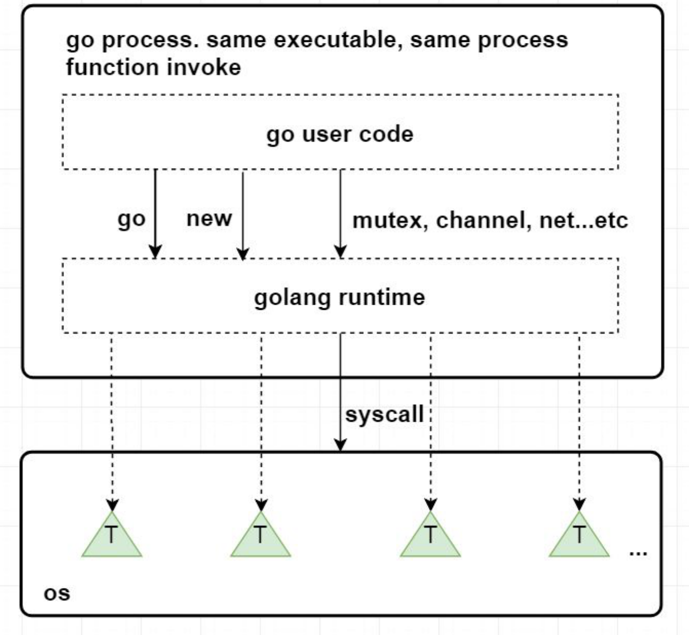
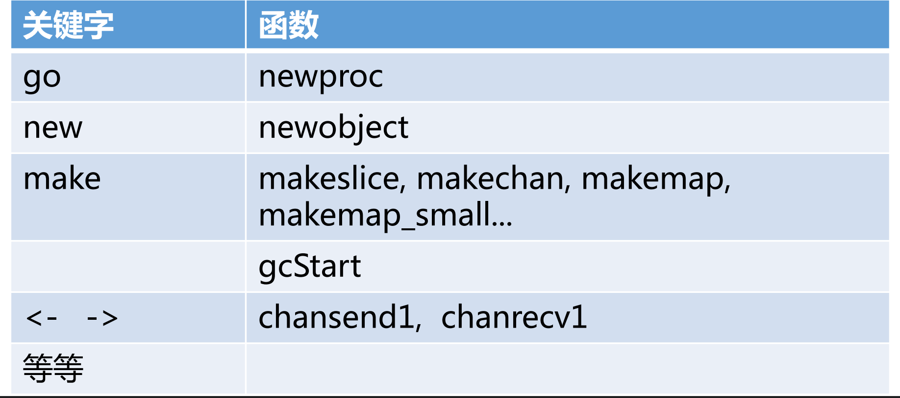
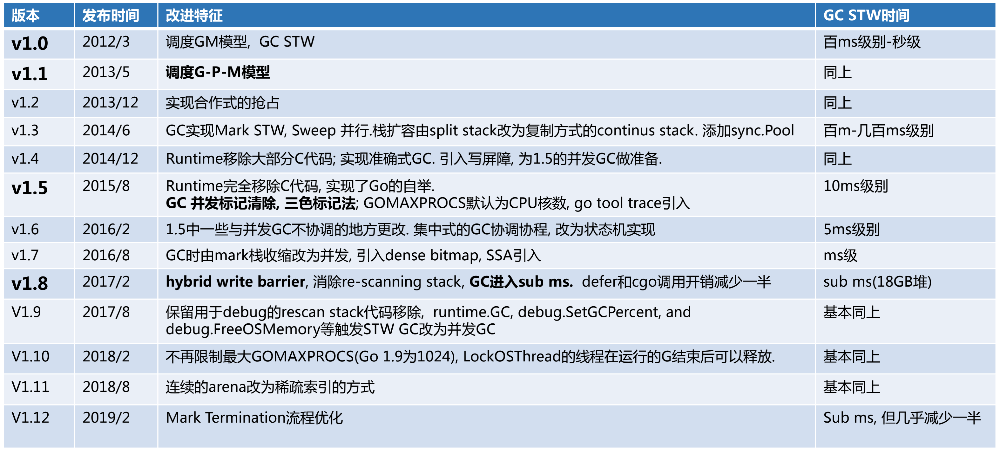

# Golang Runtime


* [runtime](#runtime)
    * [runtime.MemStats](#runtime.MemStats) 


## runtime

Golang Runtime 是 Go 语言运行所需要的基础设施。

#### 负责操作

* 协程调度、内存分配、GC；

* 操作系统及CPU相关操作的封装(信号处理，系统调用，寄存器操作，原子操作等)、CGO；

* pprof、trace、race检测的支持；

* map、channel、string等内置类型及反射的实现。




与Java、Python不同，Go并没有虚拟机的概念，runtime 也直接被编译成 native code，与用户代码一起打包到一个可执行文件当中。

用户代码与 runtime 代码在执行的时候并没有明显的界限，都是函数调用。

Go 对系统调用的指令进行了封装，可不依赖glibc。一些关键字被编译成 runtime 包下的函数。



#### 发展历程




### runtime.MemStats

`runtime.MemStats` 用于获取内存使用情况。

```go
type MemStats struct {
    // General statistics.

    // 堆内对象内存占用，和 HeapAlloc 一样
    Alloc uint64

    // 堆内对象内存申请总量，对象释放内存后，该值不会减少
    TotalAlloc uint64

    // 从系统中获取的内存总量
    Sys uint64

    // 已分配堆对象的数量，累计值
    Mallocs uint64

    // 释放堆对象的数量，累计值
    Frees uint64


    // Heap memory statistics.
    // HeapAlloc is bytes of allocated heap objects.
    // allocated heap objects 时增加，freed heap objects 时减少
    HeapAlloc uint64

    // 从系统中获取的堆内存总量，包括未使用的虚拟地址空间，和已释放物理内存的虚拟地址空间
    // HeapSys 估算了堆曾经达到的最大大小。
    HeapSys uint64

    // HeapIdle is bytes in idle (unused) spans.
    // Idle spans 表示没有对象，可以归还内存给操作系统，也可以转换为 in use 或 stack spans
    // 如果这个HeapIdle-HeapReleased差值显著大于堆的大小，则表明最近堆的活动大小出现了短暂的激增。
    HeapIdle uint64

    // HeapInuse is bytes in in-use spans.
    // In-use spans 表示至少有一个堆对象，并且可能有空闲空间用于分配更多的堆对象
    // HeapInuse 减去 HeapAlloc 估算出已分配给特定大小类别但当前未被使用的内存量。
    // 这是内存碎片的上限，但通常这些内存可以被高效地重复利用。
    HeapInuse uint64

    // HeapReleased is bytes of physical memory returned to the OS.
	//
	// This counts heap memory from idle spans that was returned
	// to the OS and has not yet been reacquired for the heap.
	HeapReleased uint64

    // heap objects 的数量
    HeapObjects uint64


    // Stack memory statistics.
    // StackInuse 表示栈 spans 中正在使用的字节数
    // 正在使用的栈 spans 至少包含一个栈。这些 spans 只能用于相同大小的其他栈。
    // 没有 StackIdle，因为未使用的栈 spans 会被归还到堆中（因此计入 HeapIdle）。
    StackInuse uint64

    // StackSys is bytes of stack memory obtained from the OS.
    // StackSys 包括 StackInuse，以及直接从操作系统获取的用于 OS 线程栈的内存。
    StackSys uint64


    // Off-heap memory statistics.
    // PauseTotalNs 表示自程序启动以来，垃圾回收 (GC) 过程中 Stop-The-World 暂停的累计时间
    PauseTotalNs uint64

    // NumGC is the number of completed GC cycles.
	NumGC uint32

    // NumForcedGC is the number of GC cycles that were forced by
	// the application calling the GC function.
	NumForcedGC uint32
```

`Heap memory statistics` 中有提到关于 `Go` 内存组织的信息，如下：

```
// Heap memory statistics.
//
// Interpreting the heap statistics requires some knowledge of
// how Go organizes memory. Go divides the virtual address
// space of the heap into "spans", which are contiguous
// regions of memory 8K or larger. A span may be in one of
// three states:
//
// An "idle" span contains no objects or other data. The
// physical memory backing an idle span can be released back
// to the OS (but the virtual address space never is), or it
// can be converted into an "in use" or "stack" span.
//
// An "in use" span contains at least one heap object and may
// have free space available to allocate more heap objects.
//
// A "stack" span is used for goroutine stacks. Stack spans
// are not considered part of the heap. A span can change
// between heap and stack memory; it is never used for both
// simultaneously.
```

使用方式：

```go
var stats runtime.MemStats
runtime.ReadMemStats(&stats)
fmt.Printf("Allocated memory: %d bytes\n", stats.Alloc)
fmt.Printf("Total allocated memory: %d bytes\n", stats.TotalAlloc)
fmt.Printf("Heap allocated memory: %d bytes\n", stats.HeapAlloc)
fmt.Printf("Number of garbage collections: %d\n", stats.NumGC)
```
